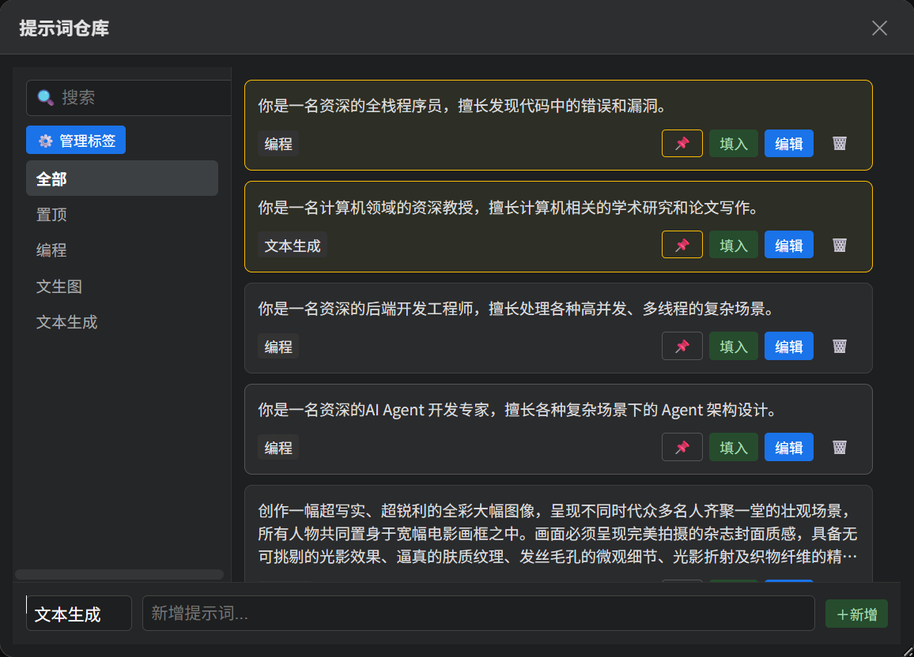
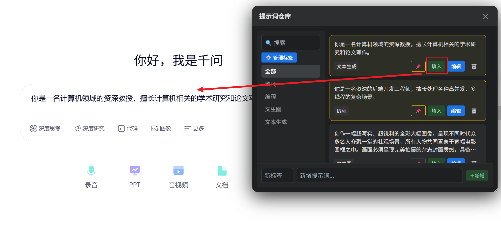
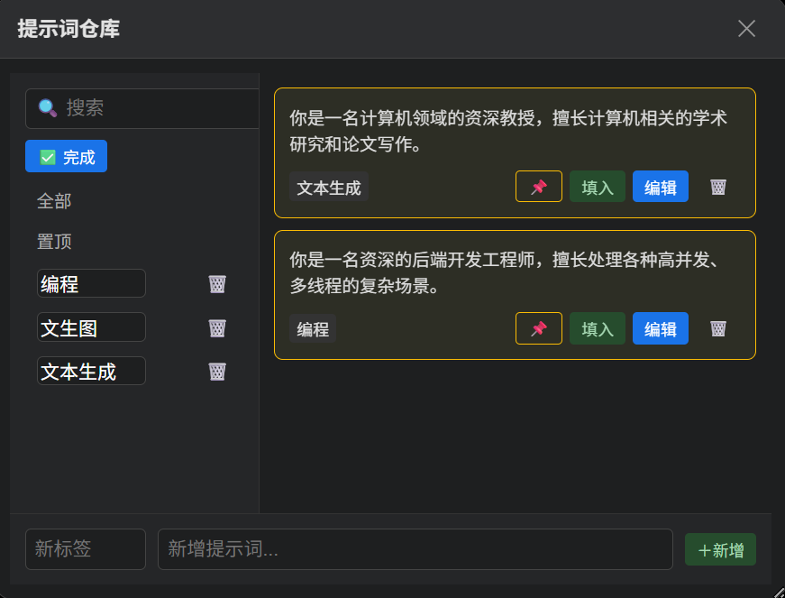
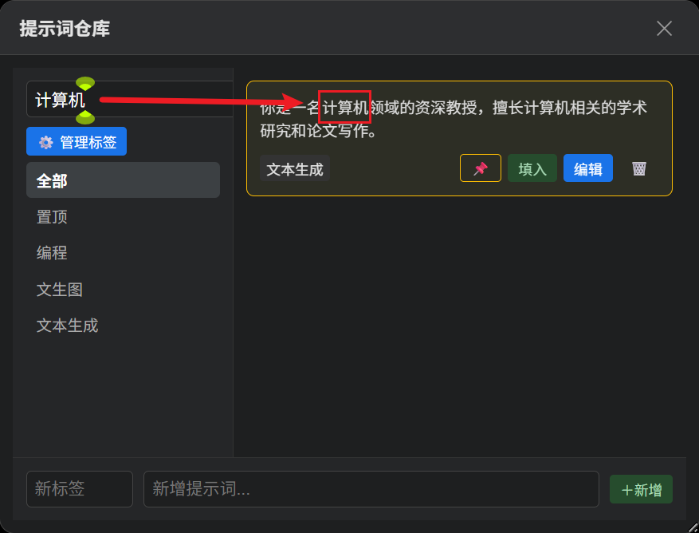
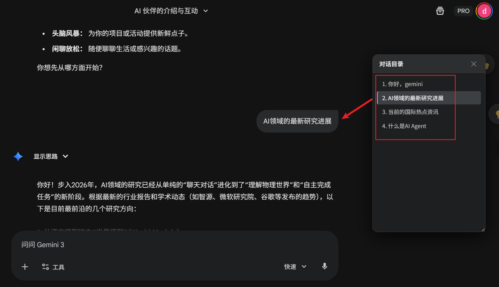
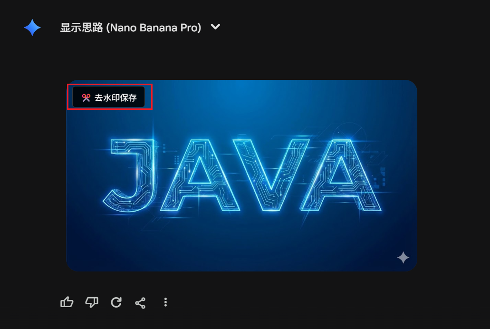
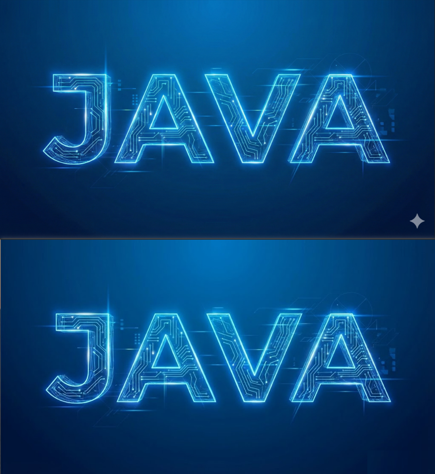
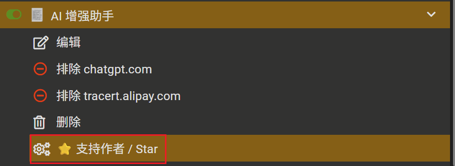

# 🚀 AI Enhancer - AI 增强助手

<strong>主流 AI 大模型通用的增强脚本</strong>

    
        <strong>
            <a href="https://greasyfork.org/zh-CN/scripts/563055-ai-%E5%A2%9E%E5%BC%BA%E5%8A%A9%E6%89%8B">脚本安装</a> | 
            <a href="https://github.com/Mrchen-1600/AI-Enhancer/blob/main/README.md">使用说明</a> |
            <a href="https://github.com/Mrchen-1600/AI-Enhancer/issues">问题反馈</a>
        </strong>
    

<strong>如果这个脚本对你有帮助，请点击右上角的 ⭐ Star 支持一下！感谢！</strong>

# 📖 简介

**AI 增强助手** 是 [Gemini 增强助手V1.0](https://greasyfork.org/zh-CN/scripts/563034-gemini-%E5%A2%9E%E5%BC%BA%E5%8A%A9%E6%89%8B-v1-0) 的升级版，现已升级为支持多平台的通用 AI 增强脚本。

它通过 **“差异化功能策略”**，为不同的 AI 模型提供最适合的增强功能。

- 对于 Gemini，它提供 **无痕去除图片水印**、**长对话目录跳转**、**常用提示词管理** 全功能体验；
- 对于 ChatGPT，由于生成的图片本身就无水印，因此仅保留了 **长对话目录跳转**、**常用提示词管理**  的功能；
- 对于 DeepSeek、豆包等国产大模型，仅保留了轻量级的 **提示词仓库** 支持，帮助你快速复用高质量 Prompt。

采用 **侧边栏半隐藏式功能按键：**

# 📱 支持平台与功能矩阵

| AI 平台           | 域名                                | 提示词库 | 对话目录 | 去水印 | 备注                               |
| ----------------- | ----------------------------------- | -------- | -------- | ------ | ---------------------------------- |
| **Google Gemini** | `gemini.google.com`                 | ✅        | ✅        | ✅      | 全功能体验，去水印支持拉伸修复     |
| **ChatGPT**       | `chatgpt.com`                       | ✅        | ✅        | ❌      | 保留长对话目录跳转和提示词管理功能 |
| **DeepSeek**      | `chat.deepseek.com`                 | ✅        | ❌        | ❌      | 界面保持原生，仅增强输入           |
| **字节豆包**      | `doubao.com`                        | ✅        | ❌        | ❌      | 界面保持原生，仅增强输入           |
| **通义千问**      | `tongyi.aliyun.com` / `qianwen.com` | ✅        | ❌        | ❌      | 界面保持原生，仅增强输入           |
| **腾讯元宝**      | `yuanbao.tencent.com`               | ✅        | ❌        | ❌      | 界面保持原生，仅增强输入           |

# ✨ 核心特性

## 1. 💡 通用提示词仓库

*支持所有适配平台*

- **拖拽排序**：支持标签组、提示词卡片的自由拖拽排序，个性化你的提示词仓库；
- **覆盖填入**：点击提示词后自动**全选并覆盖**输入框内容，避免追加在旧文本后的尴尬；
- **标签管理**：支持创建、重命名、删除标签组，支持置顶常用提示词；
- **悬浮窗记忆**：窗口位置、大小自动记忆，支持随意拖拽和缩放。

**提示词仓库**：

**一键填入提示词：**

**标签可编辑：**

**关键词检索：**

## 2. 📂 对话目录跳转导航

*仅支持 Gemini & ChatGPT*

- **Clone & Prune 技术**：采用独创的 DOM 克隆与剪枝技术，在提取对话目录前精准剔除附件名、图片标记、功能按钮文案等干扰项；
- **点击跳转**：点击目录项可快速跳转至对应对话位置；
- **UI 保活**：针对 ChatGPT 等 SPA 单页应用，自动检测并恢复被页面刷新清除的悬浮按钮。

**快速跳转对话：**

## 3. 🖼️ 图片去水印保存

*仅支持 Gemini*

- **本地拉伸算法：** 完全本地运行的去水印算法。通过提取水印上方的纹理进行垂直拉伸覆盖，完美保留背景纵向渐变，消除鬼影；
- **防遮挡设计**：去水印按钮智能吸附在图片 **左上角**，完美避开 Gemini 官方按钮。

**去水印按钮：**

**去除效果展示：**

# 📦 安装方法

1. **安装管理器**：确保你的浏览器已安装 [Tampermonkey](https://www.google.com/search?q=https://www.tampermonkey.net/) 扩展。

2. **安装脚本**：
   - **方式 A (推荐)**：[点击此处安装脚本](https://greasyfork.org/zh-CN/scripts/563055-ai-%E5%A2%9E%E5%BC%BA%E5%8A%A9%E6%89%8B)
   - **方式 B**：前往 [Greasy Fork](https://greasyfork.org/zh-CN) 搜索 "AI 增强助手" （作者：Mrchen1600）进行安装。
   
3. **使用**：打开任意支持的 AI 网站，即可在右侧看到悬浮操作按钮。

   

# ⚙️ 支持作者

**如果你觉得本脚本好用，希望可以给作者点上一个小小的🌟，你的支持是我最大的动力。**

# 📄 免责声明

本脚本仅供学习与交流使用。脚本中涉及的去水印功能仅用于个人使用与非商业用途，请尊重原图版权。本脚本与 Google 公司无关。

 Made with by <a href="https://github.com/Mrchen-1600">Mrchen</a> 

